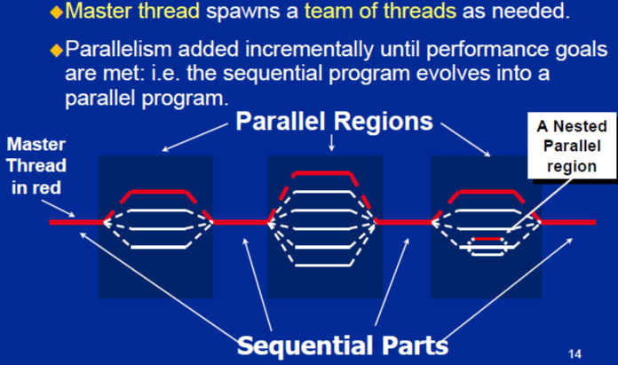

# OpenMP-101

## 0. Fast Guide: OMP in Caffe

### 0.1 What's the OMP

- an easy, portable and scalable way to parallelize applications for  many cores. – Multi-threaded, shared memory model (like pthreads) 
- a standard API
- omp pragmas are supported by major C/C++ , Fortran compilers (gcc, icc, etc).  
 
A lot of good tutorials on-line: https://computing.llnl.gov/tutorials/openMP/ http://openmp.org/mp-documents/omp-hands-on-SC08.pdf 

### 0.2 OpenMP programming model 



### 0.3 Example

naive implementation

```c
int main(int argc, char *argv[])
{
    int idx;
    float a[N], b[N], c[N];
    
    for(idx=0; idx<N; ++idx)
    {
        a[idx] = b[idx] = 1.0;
    }
    
    for(idx=0; idx<N; ++idx)
    {
        c[idx] = a[idx] + b[idx];
    }
}
```

omp implementation

```c
#include <omp.h>
int main(int argc, char *argv[])
{
    int idx;
    float a[N], b[N], c[N];
    #pragma omp parallel for
    for(idx=0; idx<N; ++idx)
    {
        a[idx] = b[idx] = 1.0;
    }
    #pragma omp parallel for
    for(idx=0; idx<N; ++idx)
    {
        c[idx] = a[idx] + b[idx];
    }
}
```

```c
#include <omp.h>
#include <stdio.h>
#include <stdlib.h>
#define N (100)
int main(int argc, char *argv[])
{
    int nthreads, tid, idx;
    float a[N], b[N], c[N];
    nthreads = omp_get_num_threads();
    printf("Number of threads = %d\n", nthreads);
    #pragma omp parallel for
    for(idx=0; idx<N; ++idx)
    {
        a[idx] = b[idx] = 1.0;
    }
    #pragma omp parallel for
    for(idx=0; idx<N; ++idx)
    {
        c[idx] = a[idx] + b[idx];
        tid = omp_get_thread_num();
        printf("Thread %d: c[%d]=%f\n", tid, idx, c[idx]);
    }
}
```

### 0.4 Compiling, linking etc 

You need to add flag –fopenmp

```shell
# compile using gcc
gcc -fopenmp omp_vecadd.c -o vecadd

# compile using icc
icc -openmp omp_vecadd.c -o vecad
```

Control number of threads through set enviroment variable on command line:

```shell
export OMP_NUM_THREADS=8 
```

### 0.5 Exercise

1. Implement
  - vector dot-product: c=<x,y>
  - matrix-matrix multiply
  - 2D matrix convolution
2. Add openmp support to relu, and max-pooling layers 

> ## note
> synch and critical sections,
> - use critical section to reduce false sharing
> - BUT don't put critical sections inside tight loops - doing so serializes things

### 0.6 Tips to Improve Performance for Popular Deep Learning Frameworks on CPUs

[improve_performance_for_deep_learning_frameworks_on_cpu](./improve_performance_for_deep_learning_frameworks_on_cpu.md)

## Tutorial1: Introduction to OpenMP

Intel’s Tim Mattson’s Introduction to OpenMP video tutorial is now available.

- [video](https://www.youtube.com/playlist?list=PLLX-Q6B8xqZ8n8bwjGdzBJ25X2utwnoEG)
- [slide](https://www.openmp.org/wp-content/uploads/Intro_To_OpenMP_Mattson.pdf)
- [exercise](http://www.openmp.org/wp-content/uploads/FMattson_OMP_exercises.zip)

Outline:

### Unit 1: Getting started with OpenMP

- Module 1: Introduction to parallel programming
- Module 2: The boring bits: Using an OpenMP compiler (hello world)
- Discussion 1: Hello world and how threads work

### Unit 2: The core features of OpenMP
- Module 3: Creating Threads (the Pi program)
- Discussion 2: The simple Pi program and why it sucks
- Module 4: Synchronization (Pi program revisited)
- Discussion 3: Synchronization overhead and eliminating false sharing
- Module 5: Parallel Loops (making the Pi program simple)
- Discussion 4: Pi program wrap-up

### Unit 3: Working with OpenMP
- Module 6: Synchronize single masters and stuff
- Module 7: Data environment
- Discussion 5: Debugging OpenMP programs
- Module 8: Skills practice … linked lists and OpenMP
- Discussion 6: Different ways to traverse linked lists

### Unit 4: a few advanced OpenMP topics
- Module 9: Tasks (linked lists the easy way)
- Discussion 7: Understanding Tasks
- Module 10: The scary stuff … Memory model, atomics, and flush (pairwise synch).
- Discussion 8: The pitfalls of pairwise synchronization
- Module 11: Threadprivate Data and how to support libraries (Pi again)
- Discussion 9: Random number generators

### Unit 5: Recapitulation

Thanks go to the University Program Office at Intel for making this tutorial available.

## Tutorial2: OpenMP

Author: Blaise Barney, Lawrence Livermore National Laboratory

[OpenMP](https://computing.llnl.gov/tutorials/openMP/)

## Tutorial3: OpenMP tutorial | Goulas Programming Soup  
https://goulassoup.wordpress.com/2011/10/28/openmp-tutorial/

## reference

- [lnarmour/omp-tutorial](https://github.com/lnarmour/omp-tutorial)

